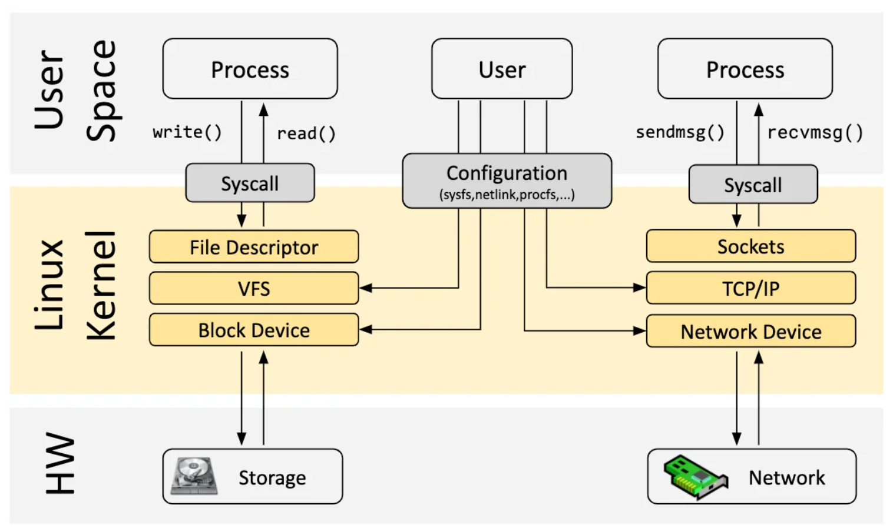
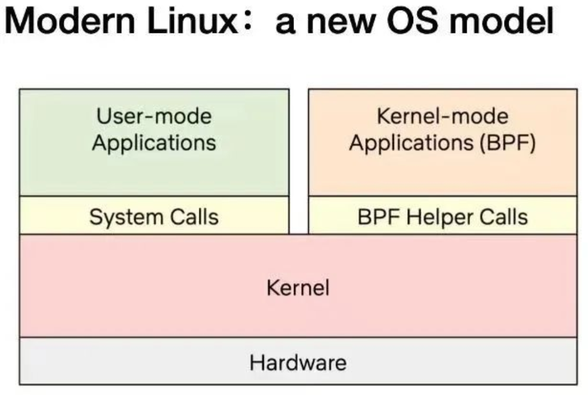

# eBPF 知识库
---
更新于 2024-09-13

## 简介
eBPF是一项革命性的技术，起源于Linux内核，可以在操作系统的内核中运行沙盒程序。  
它被用来安全和有效地扩展内核的功能，而不需要改变内核的源代码或加载内核模块。  
eBPF通过允许在操作系统内运行沙盒程序，应用程序开发人员可以在运行时，可编程地向操作系统动态添加额外的功能。 
然后，操作系统保证安全和执行效率，就像在即时编译（JIT）编译器和验证引擎的帮助下进行本地编译一样。  
eBPF 程序在内核版本之间是可移植的，并且可以自动更新，从而避免了工作负载中断和节点重启。

  
  

## 疑问
1. 如何开发一个最简单的 eBPF 程序？
2. 如何用 eBPF 追踪一个内核功能或函数？有很多种方法，举出对应的代码；
3. 有哪些方案能通过用户态和内核态通信？如何从用户态向内核态传送信息？如何从内核态向用户态传递信息？举出代码示例；
* Maps：eBPF Maps 是 eBPF 程序中最常用的一种数据结构，它们可以在用户态和内核态之间共享数据。用户态程序可以通过 BPF 系统调用来创建、更新、查找和删除 Map 中的元素，而内核态的 eBPF 程序可以在运行时访问这些元素。

* Perf Events：Perf Events 是一种可以将内核态的 eBPF 程序产生的数据发送到用户态的机制。eBPF 程序可以使用 bpf_perf_event_output 助手函数将数据发送到 Perf Event Buffer，然后用户态程序可以读取这个 Buffer 来获取数据。

* BPF 系统调用：用户态程序可以使用 BPF 系统调用来加载和管理 eBPF 程序和 Map。例如，bpf() 系统调用可以用来创建和加载 eBPF 程序，bpf_map_update_elem() 可以用来更新 Map 中的元素。

4. 编写一个你自己的 eBPF 程序，实现一个功能；
5. eBPF 程序的整个生命周期里面，分别在用户态和内核态做了哪些事情？

## 开发框架
- BCC
- BPFtrace
- libbpf
- libbpf-bootstrap
- Go eBPF library
- eunomia-bpf

## libbpf
llvm于2015年推出了可以将由高级语言编写的代码编译为eBPF字节码的功能，  
同时，eBPF 社区将 `bpf()` 等原始的系统调用进行了初步地封装，给出了`libbpf`库。  
这些库会包含将字节码加载到内核中的函数以及一些其他的关键函数。  
在Linux的源码包的`samples/bpf/`目录下，有大量Linux提供的基于`libbpf`的eBPF样例代码。

一个典型的基于 `libbpf` 的eBPF程序具有`*_kern.c`和`*_user.c`两个文件，
`*_kern.c`中书写在内核中的挂载点以及处理函数，  
`*_user.c`中书写用户态代码，完成内核态代码注入以及与用户交互的各种任务。

## eBPF可使用函数类型
- kprobe：插探函数，在指定的内核函数前或后执行。
- tracepoint：跟踪点函数，在指定的内核跟踪点处执行。
- raw_tracepoint：原始跟踪点函数，在指定的内核原始跟踪点处执行。
- xdp：网络数据处理函数，拦截和处理网络数据包。
- perf_event：性能事件函数，用于处理内核性能事件。
- kretprobe：函数返回插探函数，在指定的内核函数返回时执行。
- tracepoint_return：跟踪点函数返回，在指定的内核跟踪点返回时执行。
- raw_tracepoint_return：原始跟踪点函数返回，在指定的内核原始跟踪
- fentry/fexit
- network devices (tc/xdp)
- network routes
- TCP congestion algorithms
- sockets (data level)

userspace functions (uprobes)
system calls

## libbpf学习示例
* 1. libbpf环境安装
* 2. xdp, 打印tcp端口
* 3. tc, 打印IP信息
* 4. tracepoint,

## 示例
- [lesson 0-install](src/0-install/README.md) libbpf开发环境配置
- [lesson 1-helloworld](src/1-helloworld/README.md) 使用 eBPF 开发最简单的「Hello World」程序，介绍 eBPF 的基本框架和开发流程
- [lesson 2-kprobe-unlink](src/2-kprobe-unlink/README.md) 在 eBPF 中使用 kprobe 捕获 unlink 系统调用
- [lesson 3-fentry-unlink](src/3-fentry-unlink/README.md) 在 eBPF 中使用 fentry 捕获 unlink 系统调用
- [lesson 4-opensnoop](src/4-opensnoop/README.md) 使用 eBPF 捕获进程打开文件的系统调用集合，使用全局变量在 eBPF 中过滤进程 pid
- [lesson 5-uprobe-bashreadline](src/5-uprobe-bashreadline/README.md) 在 eBPF 中使用 uprobe 捕获 bash 的 readline 函数调用
- [lesson 6-sigsnoop](src/6-sigsnoop/README.md) 捕获进程发送信号的系统调用集合，使用 hash map 保存状态
- [lesson 7-execsnoop](src/7-execsnoop/README.md) 捕获进程执行时间，通过 perf event array 向用户态打印输出
- [lesson 8-execsnoop](src/8-exitsnoop/README.md) 捕获进程退出事件，使用 ring buffer 向用户态打印输出
- [lesson 9-runqlat](src/9-runqlat/README.md) 捕获进程调度延迟，以直方图方式记录
- [lesson 10-hardirqs](src/10-hardirqs/README.md) 使用 hardirqs 或 softirqs 捕获中断事件
- [lesson 11-bootstrap](src/11-bootstrap/README.md) 使用 libbpf-boostrap 为 eBPF 编写原生的 libbpf 用户态代码，并建立完整的 libbpf 工程。
- [lesson 12-profile](src/12-profile/README.md) 使用 eBPF 进行性能分析
- [lesson 13-tcpconnlat](src/13-tcpconnlat/README.md) 记录 TCP 连接延迟，并使用 libbpf 在用户态处理数据
- [lesson 14-tcpstates](src/14-tcpstates/README.md) 记录 TCP 连接状态与 TCP RTT
- [lesson 15-javagc](src/15-javagc/README.md) 使用 usdt 捕获用户态 Java GC 事件耗时
- [lesson 16-memleak](src/16-memleak/README.md) 检测内存泄漏
- [lesson 17-biopattern](src/17-biopattern/README.md) 捕获磁盘 IO 模式
- [lesson 18-further-reading](src/18-further-reading/README.md) 更进一步的相关资料？
- [lesson 19-lsm-connect](src/19-lsm-connect/README.md) 使用 LSM 进行安全检测防御
- [lesson 20-tc](src/20-tc/README.md) 使用 eBPF 进行 tc 流量控制
- [lesson 21-xdp](src/21-xdp/README.md) 使用 eBPF 进行 XDP 报文处理
- [在 Android 上使用 eBPF 程序](src/22-android/README.md)
- [使用 eBPF 追踪 HTTP 请求或其他七层协议](src/23-http/README.md)
- [使用 sockops 加速网络请求转发](src/29-sockops/README.md)
- [使用 eBPF 隐藏进程或文件信息](src/24-hide/README.md)
- [使用 bpf_send_signal 发送信号终止进程](src/25-signal/README.md)
- [使用 eBPF 添加 sudo 用户](src/26-sudo/README.md)
- [使用 eBPF 替换任意程序读取或写入的文本](src/27-replace/README.md)
- [BPF的生命周期：使用 Detached 模式在用户态应用退出后持续运行 eBPF 程序](src/28-detach/README.md)

## Todo
---
* bpf_xdp_sk_lookup_tcp
* bpf_xdp_skc_lookup_tcp
* bpf_skc_lookup_tcp
* bpf_fib_lookup
* bpf_skb_load_bytes
* bpf_sk_lookup
* bpf_sk_assign

BPF_PROG_TYPE_SOCK_OPS

bpf_redirect_map

### xdp-->lvs
SEC("tp_btf/inet_sock_set_state")：关注 tcp 状态转变
SEC("kprobe/inet_release")：内核释放 socket 的时候会调用这个函数

ret = bpf_redirect(TARGET_INTF, BPF_F_INGRESS);

bpf_redirect_neigh()
bpf_redirect_peer()
bpf_spin_lock 

sockmap
bpf-sock-ops

echo_dispatch

BPF_PROG_TYPE_SK_LOOKUP

## 参考
https://blog.cloudflare.com/its-crowded-in-here  
http://vger.kernel.org/lpc_net2018_talks/dsa-xdp-kernel-tables-paper.pdf  